<div align="center">
  
</div>

<div align="center">

[](https://github.com/AysenurYldz/AysenurYldz/blob/main/README.md)
[](https://github.com/AysenurYldz/AysenurYldz/blob/main/README.tr.md)

</div>

<div align="center">

[](https://linkedin.com/in/aysenuryildizz)
[](https://medium.com/@AysenurYldz)
[](https://aysenuryldz.github.io/portfolio/)
[](mailto:aysenur.yildiz.2905@gmail.com)

</div>

---

## Hi, I'm Ayşenur 👋

**I train the model — and I build the products, model or no model.**

My specialism is **computer vision, OCR and NLP**, and I lead the AI team at **Birsav Bilişim**. But a real week is wider than that: a good part of it is straight product engineering — **municipal mobile apps, sports and facility systems, HR platforms, community and entrepreneurship sites** — built with **Node.js and Next.js** on the web and **Flutter** on mobile, most of which has no model in it at all.

I like it that way. Knowing both halves is what lets me take a project from raw data, or from an empty repository, all the way to something a citizen or an employee actually opens on their phone.

Alongside this I am doing my **M.Sc. in Computer Engineering at Bursa Technical University**, focused on deep learning and computer vision.

```yaml
role:      AI Engineer  ·  Full Stack Developer
team:      AI Team Lead @ Birsav Bilişim
studying:  M.Sc. Computer Engineering, Bursa Technical University
ai_work:   OCR document analysis · real-time detection · chatbots · anomaly detection
product:   municipal mobile apps · sports systems · HR platforms · community sites
shipping:  Next.js · Node.js · Flutter · Docker · Triton · ONNX
open_to:   AI engineering roles, research collaboration, open source
```

---

## 🏗️ What I build at work

Not all of it is AI. A large share of my week is product engineering for public- and private-sector clients — full ownership of the web and mobile side, from schema to screen.

| | |
|---|---|
| 📱 **Municipal mobile applications** | Cross-platform iOS and Android apps for city services, built with Flutter and backed by Node.js APIs |
| 🏟️ **Municipal sports & facility systems** | Membership, booking and day-to-day operations for public sports facilities |
| 👥 **HR systems for the private sector** | Employee records, internal processes and reporting for company human-resources teams |
| 🌍 **Community & entrepreneurship platforms** | European-model collective venture and community sites, built on Next.js |

*I do not name clients or products here — but the shape is consistent: real users, real deadlines, and a system that has to keep working long after launch.*

---

## 🔄 How a project actually reaches someone

<div align="center">
  
</div>

Plenty of people can do one of these four boxes well. What I enjoy is owning the whole row — because the interesting problems usually live in the seams between them: the label schema that makes training tractable, the preprocessing that has to match at inference time, the latency budget that decides your architecture, the mobile screen that has to make a confidence score mean something to a human being.

---

## ⚡ Currently

- 🧠 Leading the AI team at **Birsav Bilişim** — OCR document analysis, citizen-facing chatbots, anomaly detection and tracking
- 📱 Shipping **municipal mobile apps in Flutter** and **web platforms in Next.js / Node.js** — sports and facility systems, HR systems, community sites
- 🏛️ Technical lead on the AI side of **Biryerden**, a smart-municipality platform in production
- 🎓 Researching deep learning and computer vision for my **M.Sc. at Bursa Technical University**
- ✍️ Writing about AI on [Medium](https://medium.com/@AysenurYldz)
- 💬 Happy to talk about **YOLO in production, OCR pipelines, Flutter–Node architecture, or serving models with Triton**

---

<div align="center">
  
</div>

---

## 🏆 Highlights

<table>
<tr>
<td width="33%" valign="top">

### 🥉 Teknofest 2023
**3rd place in Türkiye** — AI in Transportation

**Team captain**, ForesighTech. A YOLO-based system that finds a **safe landing zone for a UAV in real time**, telling humans, animals and vehicles apart in the landing area.

*Owned YOLO training and optimisation, plus project planning for the team.*

</td>
<td width="33%" valign="top">

### 🔬 TÜBİTAK 2209-A
**Funded research project**

An **LSTM model that reads sign language from video and translates it into text** — built to make everyday interaction easier for the hearing impaired.

*Ran it end to end: data collection, preprocessing, training, error analysis. Also my undergraduate thesis.*

</td>
<td width="33%" valign="top">

### 🩺 Teknofest 2022
**Finalist** — AI in Healthcare

A YOLO model that automatically detects **six different conditions plus the healthy case from abdominal imaging**.

*Worked on model development, data preprocessing and performance analysis.*

</td>
</tr>
</table>

---

## 🧰 Tech Stack

**Languages**


**AI / Machine Learning**


**Web & Mobile**


**Infrastructure & MLOps**


---

## 📌 Featured Projects

<table>
<tr>
<td width="50%" valign="top">

#### 🤟 [Sign Language Recognition — CNN](https://github.com/AysenurYldz/CNN-ile-isaret-dili-tanima)
Gesture-to-text recognition from video. The applied side of my **TÜBİTAK 2209-A** research on accessibility for the hearing impaired.

`Python` `TensorFlow` `CNN` `LSTM` `OpenCV`

</td>
<td width="50%" valign="top">

#### 🩻 [Breast Cancer Classification](https://github.com/AysenurYldz/Meme-Kanseri-Siniflandirma)
A benchmark of **CNN vs. EfficientNet-B7 vs. ResNet-50 vs. VGG-19** on medical imaging — architecture comparison, not just a single model.

`PyTorch` `Transfer Learning` `Medical Imaging`

</td>
</tr>
<tr>
<td width="50%" valign="top">

#### 🚁 [Agricultural Drone — Reinforcement Learning](https://github.com/AysenurYldz/Drone-based-agricultural-field-observation---Reinforcement-Learning)
A simulated farming drone that plans its own route over a field and classifies plant health as it flies.

`Python` `Reinforcement Learning` `Simulation`

</td>
<td width="50%" valign="top">

#### ⚡ [Triton Inference Server](https://github.com/AysenurYldz/Triton_Inference_Server)
Serving trained models as real production endpoints — the step between "it works on my machine" and "it works for users".

`Triton` `ONNX` `Docker` `MLOps`

</td>
</tr>
<tr>
<td width="50%" valign="top">

#### 💓 [Cardiac Arrhythmia Classification](https://github.com/AysenurYldz/Kalp-Atislari-Anormalliklerin-Siniflandirilmasi)
Anomaly detection on heartbeat signals — spotting the irregular beat inside a long, mostly-normal series.

`Python` `Anomaly Detection` `Signal Processing`

</td>
<td width="50%" valign="top">

#### 🖼️ [Image Processing with OpenCV](https://github.com/AysenurYldz/GoruntuIsleme)
The preprocessing toolbox behind the detection work: filtering, transforms, thresholding, contour and edge analysis.

`OpenCV` `Python` `Computer Vision`

</td>
</tr>
<tr>
<td width="50%" valign="top">

#### 🎮 [Deep Reinforcement Learning](https://github.com/AysenurYldz/Derin-Pekistirmeli-Ogrenme---Final)
Deep RL agents, plus a [Q-learning taxi environment](https://github.com/AysenurYldz/Taksi-Ortami-ile-Q-Ogrenme-Egitimi) built from scratch to show the algorithm one step at a time.

`Deep RL` `Q-Learning` `Gym`

</td>
<td width="50%" valign="top">

#### 🐇 [RabbitMQ Messaging](https://github.com/AysenurYldz/RabbitMQ)
Publisher/consumer messaging in Python — how asynchronous AI services actually talk to each other in production.

`RabbitMQ` `Python` `Async`

</td>
</tr>
</table>

<div align="center">

**Also in production, outside GitHub:** OCR-based document analysis pipelines · citizen-facing chatbots · anomaly detection & tracking systems · the AI side of the **Biryerden** smart-municipality platform, all at Birsav Bilişim.

</div>

---

## 📊 Activity





<picture>
  <source media="(prefers-color-scheme: dark)" srcset="https://raw.githubusercontent.com/AysenurYldz/AysenurYldz/output/snake-dark.svg" />
  
</picture>


<sub>The calendar, density and snake come from GitHub's public contribution data, generated by <code>tools/gen-contrib.mjs</code> and refreshed every morning by an Action in this repository — no third-party stats service, so nothing here can go down on someone else's server. The work-rhythm panel is read from <b>local git history</b> instead, so it also counts client work in repositories that never reached GitHub; it is refreshed by hand and the measurement date is printed on the panel.</sub>


<div align="center">


</div>

---

## 🎓 Background

| | |
|---|---|
| **M.Sc. Computer Engineering** — Bursa Technical University | 2025 – present |
| **AI Engineer & Team Lead** — Birsav Bilişim | 2025 – present |
| **SEO Engineer** — Gini Talent | 2024 – 2025 |
| **AI Engineer (R&D)** — Özdilek Ev Tekstil | 2024 |
| **B.Sc. Computer Engineering** — Sakarya University of Applied Sciences | 2020 – 2024 |
| **Intern Engineer** — Martur Fompak International · Novelty AI Technologies | 2022 – 2024 |

---

<div align="center">

### 📫 Let's build something

Open to AI engineering roles, research collaboration and open source.

[](https://linkedin.com/in/aysenuryildizz)
[](mailto:aysenur.yildiz.2905@gmail.com)
[](https://aysenuryldz.github.io/portfolio/)

<br>

<sub><i>From raw data to a screen someone actually opens.</i></sub>

</div>
