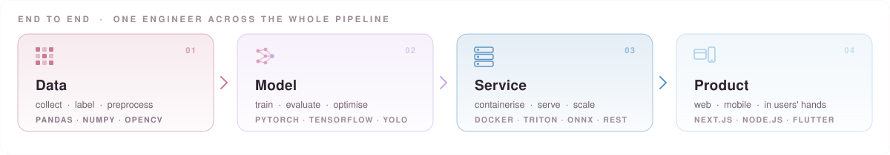
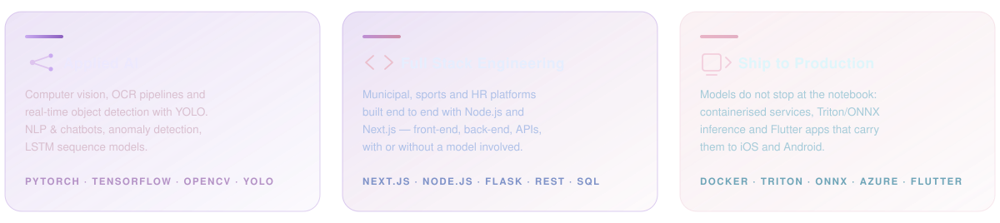

<div align="center">
  
</div>

<div align="justify">

<div align="center">

[](https://github.com/AysenurYldz/AysenurYldz/blob/main/README.md)
[](https://github.com/AysenurYldz/AysenurYldz/blob/main/README.tr.md)

</div>

<div align="center">

[](https://linkedin.com/in/aysenuryildizz)
[](https://medium.com/@AysenurYldz)
[](https://aysenuryldz.github.io/portfolio/)
[](mailto:aysenur.yildiz.2905@gmail.com)

</div>

</div>


---

## Hi, I'm Ayşenur 👋

<div align="justify">

I'm an **AI and Computer Engineer** specialising in image processing, natural language processing and deep learning. I take responsibility as a **team lead** across the whole product lifecycle — from the idea to the moment it reaches the end user — and I stay hands-on in development throughout.

I'm doing my M.Sc. at **Bursa Technical University** while working at **Birsav Bilişim**, where I am **one of the company's two team leads**. I lead projects on both the AI side and the private-sector side: project planning, task allocation, technical decisions, client presentations and the AI work itself are all mine to run.

On private- and public-sector projects I work as a **full stack developer**, building them from start to finish. With **Node.js, Next.js and Flutter** I work on municipal mobile applications, sports and facility systems, HR platforms, and community and entrepreneurship sites. In smart-municipality systems I have parts I actively work on, particularly the **Biryerden** platform. Alongside this I run AI solutions end to end — OCR-based document analysis, anomaly detection and chatbot systems.

</div>

```yaml
role:      AI & Computer Engineer  ·  Full Stack Developer
team:      one of two team leads @ Birsav Bilişim
scope:     AI on every company project · private-sector projects end to end
studying:  M.Sc. Computer Engineering, Bursa Technical University
ai_work:   OCR document analysis · real-time detection · chatbots · anomaly detection
product:   municipal mobile apps · sports systems · HR platforms · BirStok · community sites
tools:     Next.js · Node.js · Flutter · Docker · Triton · ONNX
open_to:   AI engineering roles, research collaboration, open source
```

---

## 🏗️ What I build at work

<div align="justify">

I take an active role in software development for public- and private-sector clients. On these projects the whole web and mobile side is my responsibility: I build every layer myself, from database design to the user interface.

</div>

| | |
|---|---|
| 📱 **Municipal mobile applications** | iOS and Android applications for city services, built with Flutter. They run on APIs written in Node.js. |
| 🏟️ **Municipal sports & facility systems** | Systems that manage membership, booking and day-to-day operations for public sports facilities. |
| 👥 **HR systems for the private sector** | Personnel records, internal process and reporting modules for company HR teams. |
| 🏭 **BirStok — warehouse & inventory** | A real-time digital inventory and warehouse platform that digitises industrial plate and product tracking. Every warehouse process is managed live. |
| 🌍 **Community & entrepreneurship platforms** | European-model collective venture and community sites, built with Next.js. |

---|---|
| 📱 **Municipal mobile applications** | Cross-platform iOS and Android apps for city services, built with Flutter and backed by Node.js APIs |
| 🏟️ **Municipal sports & facility systems** | Membership, booking and day-to-day operations for public sports facilities |
| 👥 **HR systems for the private sector** | Employee records, internal processes and reporting for company human-resources teams |
| 🌍 **Community & entrepreneurship platforms** | European-model collective venture and community sites, built on Next.js |


---

## 🔄 From data to product

<div align="center">
  
</div>

I work across all four stages. In practice most of the difficulty sits between them: keeping preprocessing identical at training and inference time, fitting the model into a latency budget, and turning a confidence score into something a person can actually act on.

---

## ⚡ Currently

- 🧭 One of the two team leads at **Birsav Bilişim**. Project planning, task allocation, technical decisions and client presentations are processes I run directly
- 🧠 Leading the AI side of our projects end to end: OCR-based document analysis, citizen-facing chatbot systems, anomaly detection and tracking
- 💻 Not only AI — I also do full stack development from start to finish on private- and public-sector projects
- 🏛️ Among the platforms in production that I have worked on is **Biryerden**, a smart-municipality product
- 🎓 Researching deep learning and computer vision in my M.Sc. at **Bursa Technical University**
- ✍️ Publishing articles about AI on [Medium](https://medium.com/@AysenurYldz), to share what I run into in practice and in research

---

<div align="center">
  
</div>

---

## 🏆 Highlights

<table>
<tr>
<td width="33%" valign="top" align="justify">

### 🥉 Teknofest 2023
**3rd place in Türkiye** — AI in Transportation

I served as captain of the ForesighTech team. We built a YOLO-based system that detects safe landing zones for UAVs in real time, telling humans, animals and ground vehicles apart in the landing area. As captain I managed project planning and task allocation, and I trained and optimised the YOLO architecture myself.

</td>
<td width="33%" valign="top" align="justify">

### 🔬 TÜBİTAK 2209-A
**Funded research project**

To make everyday communication easier for hearing-impaired people, I built an LSTM-based deep learning model that reads sign language from video and converts it into text. It was also my undergraduate thesis and was funded by TÜBİTAK; I ran every step myself, from data collection through model training to error analysis.

</td>
<td width="33%" valign="top" align="justify">

### 🩺 Teknofest 2022
**Finalist** — AI in Healthcare

I was the AI developer on a YOLO-based model that automatically detects six different conditions plus the healthy case from abdominal imaging. Across the project I handled model development, data preprocessing and performance analysis, contributing to our team reaching the final.

</td>
</tr>
</table>

---

## 🧰 Tech Stack


**Languages**


**AI / Machine Learning**


**Web & Mobile**


**Infrastructure & MLOps**


---

## 📌 Featured Projects

<table>
<tr>
<td width="50%" valign="top">

#### 🤟 [Sign Language Recognition — CNN](https://github.com/AysenurYldz/CNN-ile-isaret-dili-tanima)
Sign language recognition from video, turning gestures into text. This is the applied part of my TÜBİTAK 2209-A research.

`Python` `TensorFlow` `CNN` `LSTM` `OpenCV`

</td>
<td width="50%" valign="top">

#### 🩻 [Breast Cancer Classification](https://github.com/AysenurYldz/Meme-Kanseri-Siniflandirma)
I compared CNN, EfficientNet-B7, ResNet-50 and VGG-19 on the same medical imaging dataset to see how the architectures differ.

`PyTorch` `Transfer Learning` `Medical Imaging`

</td>
</tr>
<tr>
<td width="50%" valign="top">

#### 🚁 [Agricultural Drone — Reinforcement Learning](https://github.com/AysenurYldz/Drone-based-agricultural-field-observation---Reinforcement-Learning)
A simulated farming drone that plans its own route over a field and classifies plant health while flying.

`Python` `Reinforcement Learning` `Simulation`

</td>
<td width="50%" valign="top">

#### ⚡ [Triton Inference Server](https://github.com/AysenurYldz/Triton_Inference_Server)
Serving trained models as production endpoints, so they can be called by an application instead of run in a notebook.

`Triton` `ONNX` `Docker` `MLOps`

</td>
</tr>
<tr>
<td width="50%" valign="top">

#### 💓 [Cardiac Arrhythmia Classification](https://github.com/AysenurYldz/Kalp-Atislari-Anormalliklerin-Siniflandirilmasi)
Anomaly detection on heartbeat signals: finding the irregular beats in a long recording.

`Python` `Anomaly Detection` `Signal Processing`

</td>
<td width="50%" valign="top">

#### 🖼️ [Image Processing with OpenCV](https://github.com/AysenurYldz/GoruntuIsleme)
Filtering, transforms, thresholding, contour and edge analysis — the preprocessing I use before detection work.

`OpenCV` `Python` `Computer Vision`

</td>
</tr>
<tr>
<td width="50%" valign="top">

#### 🎮 [Deep Reinforcement Learning](https://github.com/AysenurYldz/Derin-Pekistirmeli-Ogrenme---Final)
Deep RL agents, plus a [Q-learning taxi environment](https://github.com/AysenurYldz/Taksi-Ortami-ile-Q-Ogrenme-Egitimi) written from scratch.

`Deep RL` `Q-Learning` `Gym`

</td>
<td width="50%" valign="top">

#### 🐇 [RabbitMQ Messaging](https://github.com/AysenurYldz/RabbitMQ)
Publisher and consumer messaging in Python, the pattern I use when services need to talk to each other asynchronously.

`RabbitMQ` `Python` `Async`

</td>
</tr>
</table>

<div align="center">

**Also in production, outside GitHub:** OCR document analysis pipelines, citizen-facing chatbots, and anomaly detection and tracking systems — the AI side of every Birsav Bilişim project, plus our private-sector work and the **Biryerden** smart-municipality platform.

</div>

---

## 📊 Activity



<picture>
  <source media="(prefers-color-scheme: dark)" srcset="https://raw.githubusercontent.com/AysenurYldz/AysenurYldz/output/snake-dark.svg" />
  
</picture>



<div align="center">


</div>

---

## 🎓 Background

<div align="justify">

Earlier in my career I worked as an SEO Engineer at **Gini Talent**, developing content strategies based on search-volume and competition analysis. At **Özdilek's R&D department** I worked on deep learning and image processing projects for the textile industry, covering everything from data labelling to deploying trained models as services with Docker. Internships at **Martur Fompak** and **Novelty AI** strengthened my practical skills in data analysis, machine learning and web application development.

</div>

| | |
|---|---|
| **Team Lead — AI & Full Stack** · Birsav Bilişim | Dec 2025 – present |
| **M.Sc. Computer Engineering** · Bursa Technical University | Feb 2025 – present |
| **SEO Engineer** · Gini Talent, remote | Oct 2024 – Jan 2025 |
| **In-company vocational training, AI** · Özdilek Ev Tekstil, R&D | Feb – Jun 2024 |
| **Intern Engineer** · Martur Fompak International, IT | Jan – Feb 2024 |
| **Intern Engineer** · Novelty AI Technologies | Aug – Sep 2022 |
| **B.Sc. Computer Engineering** · Sakarya University of Applied Sciences | Sep 2020 – Sep 2024 |

---

<div align="center">

### 📫 Get in touch

I'm open to AI engineering roles, research collaboration and open source work.

[](https://linkedin.com/in/aysenuryildizz)
[](mailto:aysenur.yildiz.2905@gmail.com)
[](https://aysenuryldz.github.io/portfolio/)

<br>

<sub><i>Bursa, Türkiye</i></sub>

</div>
