<div align="center">
  
</div>

<div align="center">

[](https://github.com/AysenurYldz/AysenurYldz/blob/main/README.md)
[](https://github.com/AysenurYldz/AysenurYldz/blob/main/README.tr.md)

</div>

<div align="center">

[](https://linkedin.com/in/aysenuryildizz)
[](https://medium.com/@AysenurYldz)
[](https://aysenuryldz.github.io/portfolio/)
[](mailto:aysenur.yildiz.2905@gmail.com)

</div>

---

## Merhaba, ben Ayşenur 👋

Görüntü işleme, doğal dil işleme ve derin öğrenme alanlarında uzmanlaşmış bir **Yapay Zekâ ve Bilgisayar Mühendisiyim**. Projelerin fikir aşamasından son kullanıcıya ulaştığı ana kadar olan ürün yaşam döngüsünde **ekip lideri** olarak sorumluluk alıyor, bizzat geliştirme süreçlerinde aktif rol oynuyorum.

Bursa Teknik Üniversitesi'nde yüksek lisans eğitimime devam etmekte olup, eş zamanlı olarak **Birsav Bilişim**'de çalışmalarımı sürdürüyorum. Burada şirketteki **iki ekip liderinden biri** olarak görev yapıyorum; hem yapay zekâ tarafında hem de özel sektör tarafında liderlik üstlendiğim projelerim mevcut. Projelerin planlaması, iş bölümü, teknik kararları, müşteri sunumları ve yapay zekâ süreçlerini bizzat yürütüyorum.

Özel sektör ve kamu projelerinde **full stack geliştirici** olarak baştan sona geliştirmeler yapıyorum. **Node.js, Next.js ve Flutter** ile belediye mobil uygulamaları, spor ve tesis sistemleri, İK platformları, topluluk ve girişim siteleri üzerine çalışmalarım bulunuyor. Akıllı belediyecilik sistemlerinde, özellikle **Biryerden** platformunda aktif olarak çalıştığım bölümler mevcut. Bununla birlikte OCR tabanlı belge analizi, anomali tespiti ve chatbot sistemleri gibi yapay zekâ çözümlerini de uçtan uca yönetiyorum.

```yaml
rol:       Yapay Zekâ ve Bilgisayar Mühendisi  ·  Full Stack Geliştirici
ekip:      İki ekip liderinden biri @ Birsav Bilişim
kapsam:    Her projenin yapay zekâ tarafı · özel sektör projeleri uçtan uca
eğitim:    Bilgisayar Mühendisliği Yüksek Lisans, Bursa Teknik Üniversitesi
yz_işi:    OCR belge analizi · gerçek zamanlı tespit · chatbot · anomali tespiti
ürün_işi:  belediye mobil uygulamaları · spor sistemleri · İK platformları · BirStok · topluluk siteleri
yayınla:   Next.js · Node.js · Flutter · Docker · Triton · ONNX
açığım:    Yapay zekâ mühendisliği pozisyonları, araştırma iş birlikleri, açık kaynak
```

---

## 🏗️ İş yerinde neler geliştiriyorum

Kamu ve özel sektör müşterileri için yazılım geliştirme süreçlerinde aktif rol alıyorum. Bu projelerde web ve mobil tarafın tamamı benim sorumluluğumda; veri tabanı tasarımından kullanıcı arayüzüne kadar tüm katmanları kendim geliştiriyorum.

| | |
|---|---|
| 📱 **Belediye mobil uygulamaları** | Şehir hizmetleri için Flutter ile iOS ve Android uygulamaları geliştiriyorum. Uygulamalar Node.js ile yazılmış API'ler üzerinden çalışıyor. |
| 🏟️ **Belediye spor ve tesis sistemleri** | Kamu spor tesislerinin üyelik, rezervasyon ve günlük işleyiş süreçlerini yöneten sistemler geliştiriyorum. |
| 👥 **Özel sektör İK sistemleri** | Şirketlerin insan kaynakları ekipleri için personel kayıtları, iç süreçler ve raporlama modülleri geliştiriyorum. |
| 🏭 **BirStok — depo ve envanter yönetimi** | Endüstriyel plaka ve ürün takip süreçlerini dijitalleştiren gerçek zamanlı envanter ve depo takip platformu. Tüm depo süreçleri dijital ortamda anlık yönetiliyor. |
| 🌍 **Topluluk ve girişim platformları** | Avrupa modeli kolektif girişim ve topluluk sitelerini Next.js ile geliştiriyorum. |

---|---|
| 📱 **Belediye mobil uygulamaları** | Şehir hizmetleri için Flutter ile geliştirilen, Node.js API'leriyle beslenen çok platformlu iOS ve Android uygulamaları |
| 🏟️ **Belediye spor ve tesis sistemleri** | Kamu spor tesisleri için üyelik, rezervasyon ve günlük işletme süreçleri |
| 👥 **Özel sektör İK sistemleri** | Şirketlerin insan kaynakları ekipleri için personel kayıtları, iç süreçler ve raporlama |
| 🌍 **Topluluk ve girişim platformları** | Next.js üzerine kurulu, Avrupa modeli kollektif girişim ve topluluk siteleri |


---

## 🔄 Veriden ürüne

<div align="center">
  
</div>

Dört aşamanın hepsinde çalışıyorum. İşin zor kısmı genelde aralarında kalıyor: ön işlemenin eğitimde ve çıkarımda birebir aynı olması, modelin gecikme bütçesine sığması, bir güven skorunun insanın karar verebileceği bir şeye dönüşmesi.

---

## ⚡ Şu anda

- 🧭 **Birsav Bilişim**'de şirketteki iki ekip liderinden biri olarak görev yapıyorum; proje planlaması, iş bölümü, teknik kararlar ve müşteri sunumları doğrudan benim yürüttüğüm süreçler
- 🧠 Projelerimizin yapay zekâ tarafını yönetiyorum: OCR tabanlı belge analizi, vatandaşlara yönelik chatbot sistemleri, anomali tespiti ve takibi — uçtan uca
- 💻 Sadece yapay zekâ odaklı kalmıyorum; özel sektör ve kamu projelerinde full stack geliştirici olarak baştan sona geliştirmeler yapıyorum
- 🏛️ Geliştirme süreçlerinde yer aldığım ve şu an üretimde olan platformlar arasında akıllı belediyecilik ürünü **Biryerden** de bulunuyor
- 🎓 **Bursa Teknik Üniversitesi**'ndeki yüksek lisans eğitimimde derin öğrenme ve bilgisayarlı görü üzerine araştırmalarımı sürdürüyorum
- ✍️ Sektördeki pratiklerimi ve araştırmalarımı paylaşmak adına yapay zekâ üzerine [Medium](https://medium.com/@AysenurYldz)'da yazılar yayımlıyorum

---

<div align="center">
  
</div>

---

## 🏆 Öne çıkanlar

<table>
<tr>
<td width="33%" valign="top">

### 🥉 Teknofest 2023
**Türkiye 3.'sü** — Ulaşımda Yapay Zekâ

ForesighTech takımının kaptanı olarak görev aldım. İHA'ların güvenli iniş alanlarını gerçek zamanlı tespit eden; iniş bölgesindeki insan, hayvan ve kara taşıtlarını anlık ayırt edebilen YOLO tabanlı bir sistem geliştirdik. Takım kaptanı olarak proje planlaması ve iş bölümü süreçlerini yönetirken, YOLO mimarisinin eğitimini ve optimizasyonunu da bizzat gerçekleştirdim.

</td>
<td width="33%" valign="top">

### 🔬 TÜBİTAK 2209-A
**Destek almaya hak kazanan araştırma projesi**

İşitme engellilerin günlük iletişimini kolaylaştırmak amacıyla, işaret dili hareketlerini videolardan okuyarak metne çeviren LSTM tabanlı bir derin öğrenme modeli geliştirdim. Aynı zamanda lisans bitirme tezim olan ve TÜBİTAK tarafından desteklenen bu projede; veri toplama aşamasından model eğitimine ve hata analizine kadar tüm adımları uçtan uca kendim yürüttüm.

</td>
<td width="33%" valign="top">

### 🩺 Teknofest 2022
**Finalist** — Sağlıkta Yapay Zekâ

Abdomen görüntülerinden altı farklı hastalığı ve sağlıklı durumu otomatik tespit eden YOLO tabanlı bir modelin yapay zekâ geliştiricisi olarak görev aldım. Proje süresince model geliştirme, veri ön işleme ve performans analizi çalışmalarını yürüterek takımımızın finalist olmasına katkı sağladım.

</td>
</tr>
</table>

---

## 🧰 Teknolojiler


**Diller**


**Yapay Zekâ / Makine Öğrenmesi**


**Web ve Mobil**


**Altyapı ve MLOps**


---

## 📌 Öne çıkan projeler

<table>
<tr>
<td width="50%" valign="top">

#### 🤟 [CNN ile İşaret Dili Tanıma](https://github.com/AysenurYldz/CNN-ile-isaret-dili-tanima)
Videodan işaret dilini okuyup metne çeviren tanıma sistemi. TÜBİTAK 2209-A araştırmamın uygulama tarafı.

`Python` `TensorFlow` `CNN` `LSTM` `OpenCV`

</td>
<td width="50%" valign="top">

#### 🩻 [Meme Kanseri Sınıflandırma](https://github.com/AysenurYldz/Meme-Kanseri-Siniflandirma)
CNN, EfficientNet-B7, ResNet-50 ve VGG-19 mimarilerini aynı tıbbi görüntü veri seti üzerinde karşılaştırdım.

`PyTorch` `Transfer Learning` `Tıbbi Görüntüleme`

</td>
</tr>
<tr>
<td width="50%" valign="top">

#### 🚁 [Tarım Dronu — Pekiştirmeli Öğrenme](https://github.com/AysenurYldz/Drone-based-agricultural-field-observation---Reinforcement-Learning)
Tarla üzerindeki rotasını kendi planlayan, uçarken bitki sağlığını sınıflandıran drone simülasyonu.

`Python` `Pekiştirmeli Öğrenme` `Simülasyon`

</td>
<td width="50%" valign="top">

#### ⚡ [Triton Inference Server](https://github.com/AysenurYldz/Triton_Inference_Server)
Eğitilen modelleri üretim uç noktası olarak servisleştirme; not defterinde çalıştırmak yerine uygulamadan çağrılabilir hale getirme.

`Triton` `ONNX` `Docker` `MLOps`

</td>
</tr>
<tr>
<td width="50%" valign="top">

#### 💓 [Kalp Atışı Anormallik Sınıflandırma](https://github.com/AysenurYldz/Kalp-Atislari-Anormalliklerin-Siniflandirilmasi)
Kalp atışı sinyallerinde anomali tespiti: uzun bir kayıt içindeki düzensiz atışları bulma.

`Python` `Anomali Tespiti` `Sinyal İşleme`

</td>
<td width="50%" valign="top">

#### 🖼️ [OpenCV ile Görüntü İşleme](https://github.com/AysenurYldz/GoruntuIsleme)
Filtreleme, dönüşümler, eşikleme, kontur ve kenar analizi — tespit çalışmalarından önce kullandığım ön işleme adımları.

`OpenCV` `Python` `Bilgisayarlı Görü`

</td>
</tr>
<tr>
<td width="50%" valign="top">

#### 🎮 [Derin Pekiştirmeli Öğrenme](https://github.com/AysenurYldz/Derin-Pekistirmeli-Ogrenme---Final)
Derin RL ajanları ve sıfırdan yazılmış bir [Q-öğrenme taksi ortamı](https://github.com/AysenurYldz/Taksi-Ortami-ile-Q-Ogrenme-Egitimi).

`Derin RL` `Q-Learning` `Gym`

</td>
<td width="50%" valign="top">

#### 🐇 [RabbitMQ Mesajlaşma](https://github.com/AysenurYldz/RabbitMQ)
Python ile publisher/consumer mesajlaşma; servislerin birbiriyle asenkron konuşması gerektiğinde kullandığım yapı.

`RabbitMQ` `Python` `Async`

</td>
</tr>
</table>

<div align="center">

**GitHub dışında, üretimde:** OCR belge analizi boru hatları, vatandaşa yönelik chatbot'lar, anomali tespiti ve takip sistemleri — Birsav Bilişim'deki her projenin yapay zekâ tarafı, özel sektör işlerimiz ve akıllı belediyecilik platformumuz **Biryerden**.

</div>

---

## 📊 Aktivite



<picture>
  <source media="(prefers-color-scheme: dark)" srcset="https://raw.githubusercontent.com/AysenurYldz/AysenurYldz/output/snake-dark.svg" />
  
</picture>



<div align="center">


</div>

---

## 🎓 Eğitim ve deneyim

Önceki profesyonel deneyimlerim arasında **Gini Talent** bünyesinde SEO Mühendisi olarak görev aldığım ve arama hacmi ile rekabet analizlerine dayalı içerik stratejileri geliştirdiğim çalışmalarım yer alıyor. **Özdilek Ar-Ge** departmanında tekstil sektörüne yönelik derin öğrenme ve görüntü işleme projelerinde bulundum; veri etiketleme süreçlerinden eğitilen modellerin Docker ile servisleştirilmesine kadar olan aşamalarda görev aldım. **Martur Fompak** ve **Novelty Yapay Zekâ**'da gerçekleştirdiğim stajlarla veri analizi, makine öğrenmesi ve web uygulamaları geliştirme konularındaki pratik yetkinliklerimi pekiştirdim.

| | |
|---|---|
| **Ekip Lideri — Yapay Zekâ & Full Stack** · Birsav Bilişim | Ara 2025 – devam |
| **Bilgisayar Mühendisliği, Yüksek Lisans** · Bursa Teknik Üniversitesi | Şub 2025 – devam |
| **SEO Mühendisi** · Gini Talent, uzaktan | Eki 2024 – Oca 2025 |
| **İşletmede Mesleki Eğitim, Yapay Zekâ** · Özdilek Ev Tekstil, Ar-Ge | Şub – Haz 2024 |
| **Stajyer Mühendis** · Martur Fompak International, BT | Oca – Şub 2024 |
| **Stajyer Mühendis** · Novelty Yapay Zekâ Teknolojileri | Ağu – Eyl 2022 |
| **Bilgisayar Mühendisliği, Lisans** · Sakarya Uygulamalı Bilimler Üniversitesi | Eyl 2020 – Eyl 2024 |

---

<div align="center">

### 📫 İletişim

Yapay zekâ mühendisliği pozisyonlarına, araştırma iş birliklerine ve açık kaynak projelere açığım.

[](https://linkedin.com/in/aysenuryildizz)
[](mailto:aysenur.yildiz.2905@gmail.com)
[](https://aysenuryldz.github.io/portfolio/)

<br>

<sub><i>Bursa, Türkiye</i></sub>

</div>
