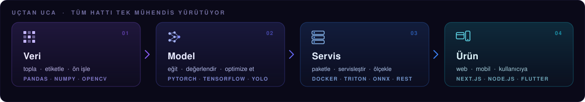
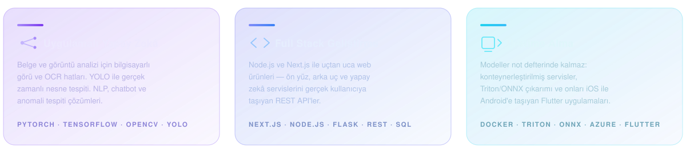

<div align="center">
  
</div>

<div align="center">

[](https://github.com/AysenurYldz/AysenurYldz/blob/main/README.md)
[](https://github.com/AysenurYldz/AysenurYldz/blob/main/README.tr.md)

</div>

<div align="center">

[](https://linkedin.com/in/aysenuryildizz)
[](https://medium.com/@AysenurYldz)
[](https://aysenuryldz.github.io/portfolio/)
[](mailto:aysenur.yildiz.2905@gmail.com)

</div>

---

## Merhaba, ben Ayşenur 👋

**Modeli ben eğitiyorum — etrafındaki ürünü de ben kuruyorum.**

Günümün büyük bölümü **bilgisayarlı görü, OCR ve doğal dil işleme** üzerinde geçiyor. Ama not defterinden çıkmayan bir model ürün değildir; bu yüzden onu servis eden **Next.js / Node.js** katmanını ve telefona taşıyan **Flutter** uygulamasını da ben yazıyorum. Full stack tarafı bilinçli bir tercih: bir projeyi ham veriden, vatandaşın ya da müşterinin gerçekten açtığı bir ekrana kadar götürmemi sağlayan şey bu.

Şu anda **Birsav Bilişim'de yapay zekâ ekibinin teknik liderliğini** yürütüyor, **Bursa Teknik Üniversitesi'nde Bilgisayar Mühendisliği yüksek lisansımı** derin öğrenme ve bilgisayarlı görü odağında sürdürüyorum.

```yaml
rol:       Yapay Zekâ Mühendisi  ·  Full Stack Geliştirici
ekip:      Yapay Zekâ Ekip Lideri @ Birsav Bilişim
eğitim:    Bilgisayar Mühendisliği Yüksek Lisans, Bursa Teknik Üniversitesi
geliştir:  OCR belge analizi · gerçek zamanlı tespit · chatbot · anomali tespiti
yayınla:   Next.js · Node.js · Flutter · Docker · Triton · ONNX
açığım:    Yapay zekâ mühendisliği pozisyonları, araştırma iş birlikleri, açık kaynak
```

---

## 🔄 Bir proje insana nasıl ulaşıyor

<div align="center">
  
</div>

Bu dört kutudan birini iyi yapabilen çok kişi var. Benim keyif aldığım şey satırın tamamını üstlenmek — çünkü ilginç problemler genelde kutuların *arasındaki dikişlerde* yaşıyor: eğitimi mümkün kılan etiket şeması, çıkarım anında birebir eşleşmesi gereken ön işleme, mimariyi belirleyen gecikme bütçesi ve bir güven skorunu insan için anlamlı hale getirmek zorunda olan mobil ekran.

---

## ⚡ Şu anda

- 🧠 **Birsav Bilişim**'de yapay zekâ ekibini yönetiyorum — OCR belge analizi, vatandaşa yönelik chatbot'lar, anomali tespiti ve takibi
- 🏛️ Üretimdeki akıllı belediyecilik platformu **Biryerden**'in yapay zekâ tarafında teknik liderlik yapıyorum
- 🎓 **Bursa Teknik Üniversitesi** yüksek lisansımda derin öğrenme ve bilgisayarlı görü üzerine araştırma yapıyorum
- ✍️ Yapay zekâ üzerine [Medium](https://medium.com/@AysenurYldz)'da yazıyorum
- 💬 **Üretimde YOLO, OCR boru hatları, LSTM dizi modelleri veya Triton ile model servisleştirme** konularını konuşmaktan keyif alırım

---

<div align="center">
  
</div>

---

## 🏆 Öne çıkanlar

<table>
<tr>
<td width="33%" valign="top">

### 🥉 Teknofest 2023
**Türkiye 3.'sü** — Ulaşımda Yapay Zekâ

**Takım kaptanı**, ForesighTech. İHA'ların **güvenli iniş alanını gerçek zamanlı belirleyen**; iniş bölgesindeki insan, hayvan ve kara taşıtlarını anlık ayırt eden YOLO tabanlı bir sistem.

*YOLO mimarisinin eğitimi ve optimizasyonundan sorumluydum; ayrıca takımın proje planlamasını yürüttüm.*

</td>
<td width="33%" valign="top">

### 🔬 TÜBİTAK 2209-A
**Destek almaya hak kazanan araştırma projesi**

İşitme engellilerin günlük etkileşimini kolaylaştırmak için geliştirilen, **işaret dili hareketlerini videodan okuyup metne çeviren LSTM tabanlı bir model**.

*Veri toplama, ön işleme, model eğitimi ve hata analizini uçtan uca yürüttüm. Aynı zamanda lisans bitirme tezim.*

</td>
<td width="33%" valign="top">

### 🩺 Teknofest 2022
**Finalist** — Sağlıkta Yapay Zekâ

Abdomen görüntülerinden **altı farklı hastalığı ve sağlıklı durumu** otomatik tespit eden YOLO tabanlı bir model.

*Model geliştirme, veri ön işleme ve performans analizi süreçlerinde çalıştım.*

</td>
</tr>
</table>

---

## 🧰 Teknolojiler

**Diller**


**Yapay Zekâ / Makine Öğrenmesi**


**Web ve Mobil**


**Altyapı ve MLOps**


---

## 📌 Öne çıkan projeler

<table>
<tr>
<td width="50%" valign="top">

#### 🤟 [CNN ile İşaret Dili Tanıma](https://github.com/AysenurYldz/CNN-ile-isaret-dili-tanima)
Videodan işaret dili hareketlerini metne çeviren tanıma sistemi. İşitme engelliler için erişilebilirlik üzerine **TÜBİTAK 2209-A** araştırmamın uygulama tarafı.

`Python` `TensorFlow` `CNN` `LSTM` `OpenCV`

</td>
<td width="50%" valign="top">

#### 🩻 [Meme Kanseri Sınıflandırma](https://github.com/AysenurYldz/Meme-Kanseri-Siniflandirma)
Tıbbi görüntüler üzerinde **CNN, EfficientNet-B7, ResNet-50 ve VGG-19** karşılaştırması — tek model demosu değil, mimari kıyaslaması.

`PyTorch` `Transfer Learning` `Tıbbi Görüntüleme`

</td>
</tr>
<tr>
<td width="50%" valign="top">

#### 🚁 [Tarım Dronu — Pekiştirmeli Öğrenme](https://github.com/AysenurYldz/Drone-based-agricultural-field-observation---Reinforcement-Learning)
Tarla üzerindeki rotasını kendi planlayan ve uçarken bitki sağlığını sınıflandıran drone simülasyonu.

`Python` `Pekiştirmeli Öğrenme` `Simülasyon`

</td>
<td width="50%" valign="top">

#### ⚡ [Triton Inference Server](https://github.com/AysenurYldz/Triton_Inference_Server)
Eğitilen modellerin gerçek üretim uç noktaları olarak servisleştirilmesi — "benim makinemde çalışıyor" ile "kullanıcıda çalışıyor" arasındaki adım.

`Triton` `ONNX` `Docker` `MLOps`

</td>
</tr>
<tr>
<td width="50%" valign="top">

#### 💓 [Kalp Atışı Anormallik Sınıflandırma](https://github.com/AysenurYldz/Kalp-Atislari-Anormalliklerin-Siniflandirilmasi)
Uzun ve büyük ölçüde normal bir kalp atışı serisi içinde düzensiz atışı bulmak — anomali tespitinin klasik zor vakası.

`Python` `Anomali Tespiti` `Sinyal İşleme`

</td>
<td width="50%" valign="top">

#### 🖼️ [OpenCV ile Görüntü İşleme](https://github.com/AysenurYldz/GoruntuIsleme)
Tespit çalışmalarının arkasındaki ön işleme araç kutusu: filtreleme, dönüşümler, eşikleme, kontur ve kenar analizi.

`OpenCV` `Python` `Bilgisayarlı Görü`

</td>
</tr>
<tr>
<td width="50%" valign="top">

#### 🎮 [Derin Pekiştirmeli Öğrenme](https://github.com/AysenurYldz/Derin-Pekistirmeli-Ogrenme---Final)
Derin RL ajanları ve algoritmayı adım adım gösteren, sıfırdan yazılmış bir [Q-öğrenme taksi ortamı](https://github.com/AysenurYldz/Taksi-Ortami-ile-Q-Ogrenme-Egitimi).

`Derin RL` `Q-Learning` `Gym`

</td>
<td width="50%" valign="top">

#### 🐇 [RabbitMQ Mesajlaşma](https://github.com/AysenurYldz/RabbitMQ)
Python ile publisher/consumer mesajlaşma — asenkron yapay zekâ servislerinin üretimde birbiriyle gerçekte nasıl konuştuğu.

`RabbitMQ` `Python` `Async`

</td>
</tr>
</table>

<div align="center">

**GitHub dışında, üretimde:** OCR tabanlı belge analizi boru hatları · vatandaşa yönelik chatbot'lar · anomali tespiti ve takip sistemleri · akıllı belediyecilik platformu **Biryerden**'in yapay zekâ tarafı — tümü Birsav Bilişim'de.

</div>

---

## 📊 GitHub Aktivitesi

<div align="center">


</div>

---

## 🎓 Eğitim ve deneyim

| | |
|---|---|
| **Bilgisayar Mühendisliği, Yüksek Lisans** — Bursa Teknik Üniversitesi | 2025 – devam ediyor |
| **Yapay Zekâ Mühendisi & Ekip Lideri** — Birsav Bilişim | 2025 – devam ediyor |
| **SEO Mühendisi** — Gini Talent | 2024 – 2025 |
| **Yapay Zekâ Mühendisi (Ar-Ge)** — Özdilek Ev Tekstil | 2024 |
| **Bilgisayar Mühendisliği, Lisans** — Sakarya Uygulamalı Bilimler Üniversitesi | 2020 – 2024 |
| **Stajyer Mühendis** — Martur Fompak International · Novelty Yapay Zekâ Teknolojileri | 2022 – 2024 |

---

<div align="center">

### 📫 Birlikte bir şey kuralım

Yapay zekâ mühendisliği pozisyonlarına, araştırma iş birliklerine ve açık kaynak projelere açığım.

[](https://linkedin.com/in/aysenuryildizz)
[](mailto:aysenur.yildiz.2905@gmail.com)
[](https://aysenuryldz.github.io/portfolio/)

<br>

<sub><i>Ham veriden, birinin gerçekten açtığı bir ekrana.</i></sub>

</div>
